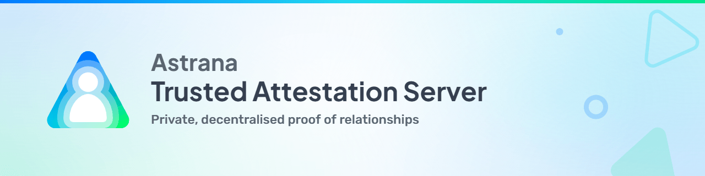
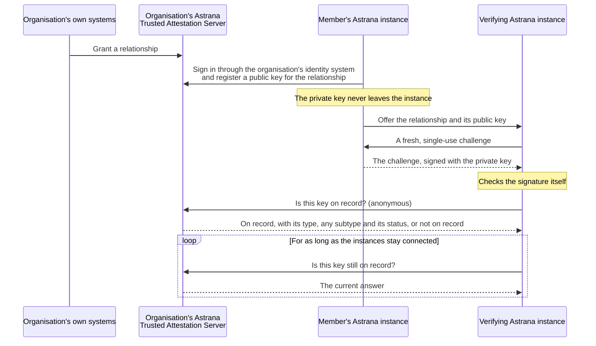

<picture>
  <source media="(prefers-color-scheme: dark)" srcset=".github/banner-dark.png">
  
</picture>

[](LICENSE.md)
[](https://github.com/astrana-project/astrana-trusted-attestation-server/actions/workflows/integration.yml)
[](https://github.com/astrana-project/astrana-trusted-attestation-server/actions/workflows/codeql.yml)
[](https://github.com/astrana-project/astrana-trusted-attestation-server/actions/workflows/format.yml)
[](https://sonarcloud.io/summary/new_code?id=astrana-trusted-attestation-server-dotnet)
[](https://sonarcloud.io/summary/new_code?id=astrana-trusted-attestation-server-java)
[](https://sonarcloud.io/summary/new_code?id=astrana-trusted-attestation-server-php)

<br/>

The **Astrana Trusted Attestation Server** lets Astrana instances trust each other more, without any central authority.

> [!NOTE]
>
> Astrana is a self-hosted, peer-to-peer social networking application.<br/> See [astrana.org](https://astrana.org) for
> more information.

When two people first connect their Astrana instances, each has to decide whether the instance on the other side really
belongs to the person they think it does. That is the moment impersonation is cheapest, because a name, a photograph and
a plausible first message are all an impostor needs. An attestation adds something an impostor cannot supply, an
organisation's live confirmation that the holder of an attestation key has a relationship with it.

Astrana Trusted Attestation works by passing on the trust people already place in an organisation. An organisation is
the one that knows which of its relationships with people are genuine. Each relationship carries its own kind and degree
of trust. That depends on how much the organisation checked about who the person is, and on what the relationship means.

Each relationship tells a person something different, whether it is an employer and its employee, a professional body
and someone it has accredited, a bank and a customer whose identity it has checked, or a church or club and one of its
community members.

A bank's attestation establishes legal identity, because a bank has checked its customer against official identity
documents before opening an account. Membership of a church or club establishes what no document can. It shows that the
person is real, that the people who run it and its other members know them personally and that they belong to a
community that would notice an impostor. Neither outranks the other. They answer different questions, and someone
deciding whether to trust a connection may want either, or both.

Astrana Trusted Attestation lets organisations vouch for specific relationships. An Astrana instance owner who trusts an
organisation can extend that trust to other Astrana instance owners. An attestation is one of the things an owner can
weigh when deciding whether to trust another, and often a significant one. An instance can also combine attestations
from several organisations it trusts, and each one adds weight.

How much to trust someone stays the Astrana instance owner's decision. The server does not judge or rank anyone. It
answers one question, whether a key is on record. If it is, the answer also gives the type, any subtype and the status
of the one relationship the key belongs to, and nothing more. It is not an identity provider, not a reputation score and
not a directory. A member decides when to register a key and when to prove a relationship. From then on, the verifying
Astrana instances talk to the server to check the key.

Astrana Trusted Attestation is designed to fit into the existing infrastructure, operations and governance of the
organisations that run it. It runs on the organisation's own stack, with implementations available for .NET, Java and
PHP. Members sign in through the identity and access management system the organisation already uses, over the open
standards OpenID Connect or SAML. Any provider that supports either works without special integration, as long as it
presents an identifier the organisation already holds for each member. The server keeps a small record, in a database of
a kind the organisation already runs (PostgreSQL, MySQL or SQL Server), on an existing database server or a dedicated
one. Granting, revoking and extending relationships stay with the organisation's own systems and processes.

## How it works

1. **The organisation grants a relationship.** Only the organisation can grant one. There is no page and no endpoint for
   granting, and a member cannot grant a relationship to themselves. A new relationship has no key yet.

2. **The member registers an attestation key.** The member signs in through the organisation's own identity and access
   management system (OpenID Connect or SAML) and registers a public key for each relationship the organisation has
   granted. Each relationship has its own key, so disclosing one reveals nothing about the others. The private key never
   leaves the member's Astrana instance. There is no approval step. Signing in through the organisation's system is the
   check.

3. **An Astrana instance verifies.** When connecting to another Astrana instance, a member chooses which of their
   relationships to offer it. That instance sends a fresh, single-use challenge and checks the member's signature over
   it. This proves the member holds that relationship's private key. The instance then asks the organisation's Astrana
   Trusted Attestation Server whether the key is on record and, if it is, for the type, any subtype and the status of
   its relationship. The instance accepts the relationship only when its status is active. The query is anonymous and
   returns only that one relationship, so the organisation never learns who is asking and the member's other
   relationships stay private. Nothing reusable changes hands. A public key is public, and the challenge is never used
   twice.

4. **The attestation is periodically checked again.** For as long as the Astrana instances remain connected to each
   other, the verifying Astrana instance asks the organisation's Astrana Trusted Attestation Server again from time to
   time. Each check answers valid, invalid or unreachable. Unreachable means unknown, not invalid, so a network fault or
   an organisation's maintenance window never ends an attestation. When the organisation revokes a relationship, or a
   member revokes their own, the next check sees it. What an instance does with an invalid answer is its owner's
   decision. Nothing happens automatically.

<br/>



<br/>

A member can clear a key to pause attestation without giving up the grant, revoke a relationship themselves or remove it
entirely. Only the organisation can restore a revoked relationship or grant a removed one again. Registering a new key
replaces the old one, so from then on a check of the old key answers invalid. The member's other relationships are not
affected.

Attestation is a live lookup, not an offline proof. If an organisation cannot be reached, nothing it has attested
becomes invalid, but nothing new can be confirmed with it until it is back. Holding attestations from more than one
organisation reduces that dependence.

People see only three pages, the landing page, the self-service page and the licence page. The landing page also
confirms a sign-out.

The pages come in light and dark, and follow the member's own device setting.

<p>
  
  
</p>

## Quick start

See it running on your own machine with one command. Each implementation ships a self-contained demonstration with the
application, its database, a TLS-terminating proxy and a throwaway identity provider. You need only Docker, and
`openssl` to make a key to register.

The .NET demonstration runs Microsoft's free SQL Server Developer edition, and by starting it you accept the
[SQL Server Developer licence terms](https://go.microsoft.com/fwlink/?linkid=857698). Start it from the repository root:

```bash
docker compose -f dotnet/demo/docker-compose.yml up --build
```

Then open https://localhost:15443 and sign in with the username `alice` and the password `password`. The Java and PHP
demonstrations work the same way, on ports 16443 and 17443. The full walkthrough, including how to grant a relationship,
is in the [quick start guide](docs/quickstart.md).

## Three implementations, one contract

Astrana Trusted Attestation comes as three production implementations. Each is written the way its own stack is normally
written, and each suits a different kind of organisation. All three behave identically on everything the contract and
the shared interface define, so an organisation can run it on the stack and database it already has. A verifying Astrana
instance cannot tell which one answered any request the contract defines, and Astrana is built against one contract
rather than three codebases.

| Implementation          | Fits                                                                                                             |
| ----------------------- | ---------------------------------------------------------------------------------------------------------------- |
| **.NET** (ASP.NET Core) | Enterprises and government departments, especially those built on Microsoft systems                              |
| **Java** (Spring Boot)  | Enterprises and government departments, such as in finance, insurance and healthcare                             |
| **PHP** (Laravel)       | Small organisations, such as clubs, community groups, congregations and charities, on low-cost or shared hosting |

Each implementation supports PostgreSQL, MySQL and SQL Server, so an organisation can use the database it already runs.
The published PHP container image leaves SQL Server support out, so an organisation that runs the PHP container on SQL
Server builds its own image.

The three are checked against each other on every change to an implementation or to `shared/`. The conformance suite
runs against each implementation, the differential suite sends the same requests to all three and compares the answers,
and the accessibility suite checks the landing page and the self-service page of each. The current results for `master`
are published at
[astrana-project.github.io/astrana-trusted-attestation-server](https://astrana-project.github.io/astrana-trusted-attestation-server/).

[](https://github.com/astrana-project/astrana-trusted-attestation-server/actions/workflows/integration.yml)

## Layout

```
.
├── dotnet/  java/  php/       the three implementations (each with a README, CHANGELOG and software bill of materials)
├── shared/
│   ├── contract/             openapi.yaml, attribution.json, manifest.schema.json, relationship-types.json
│   ├── schema/               schema-{postgres,mysql,mssql}.sql
│   ├── ui/                   scss source + compiled css + favicon + ui-strings.json
│   ├── test/                 conformance, differential, accessibility, schema and role checks
│   └── test-material/        personas, scenarios, Gherkin test-cases
├── docs/
│   ├── quickstart.md         the demonstration, step by step
│   ├── installation.md       installing and configuring the server
│   ├── installation/         one installation page per implementation
│   ├── glossary.md           the terms the documentation uses
│   ├── relationship-types.md what each relationship type means
│   ├── adr/                  architecture decision records
│   └── screenshots/          the images the documentation shows
├── scripts/                   setup, format, check and integration helpers, and the git hooks
└── .github/                  workflows, the changelog and sign-off checks, issue and pull request templates,
                              copilot-instructions.md
```

Everything under `shared/contract`, `shared/schema` and `shared/ui` is the single source of the contract, the schemas,
the stylesheet and strings, and the relationship-type vocabulary. Each implementation copies it in at build time instead
of maintaining a copy of its own, so the three cannot drift apart.

## Documentation

The [quick start](docs/quickstart.md) runs a demonstration on your own machine. The
[installation guide](docs/installation.md) covers registering the server with your identity system, the database, the
configuration, and granting, revoking and extending relationships. The [glossary](docs/glossary.md) defines the terms
the documentation uses.

These files define what every implementation must do:

- **The API**, every request and response shape, is [shared/contract/openapi.yaml](shared/contract/openapi.yaml).
- **The manifest**, its fields and an example, is
  [shared/contract/manifest.schema.json](shared/contract/manifest.schema.json).
- **The relationship types** are listed with their labels in
  [shared/contract/relationship-types.json](shared/contract/relationship-types.json), and what each one means is on the
  [relationship types page](docs/relationship-types.md).
- **The footer and the licence page** render [shared/contract/attribution.json](shared/contract/attribution.json).
- **The tables, the procedures, the audit log and the database roles** are the schema files in
  [shared/schema](shared/schema), one per engine.
- **The stylesheet, the strings and the markup the pages share** are in [shared/ui](shared/ui).
- **Every other behaviour**, with the reasons for it and what it costs, is in the
  [architecture decision records](docs/adr), read in the order their index gives.
- **What conformance and parity mean** is defined by the suites in [shared/test](shared/test).

## Contributing

See [CONTRIBUTING.md](CONTRIBUTING.md).

The maintainer develops this project with AI coding assistants and reviews everything they produce. Contributors may use
them too.

## Licence

Except where a file states otherwise, the source code and documentation in this repository are licensed under the
[MIT License](LICENSE.md). The exceptions are:

- the Maven wrapper in `java/`, which is under the Apache License 2.0
- the [Developer Certificate of Origin](DCO)
- the compiled Bootstrap styles in `shared/ui/dist`, which keep Bootstrap's own MIT notice
- the Astrana logo images
- the files under `shared/third-party` and the sample logo in `shared/test`, which state their own terms

The name Astrana and the Astrana logos and other brand features are **trademarks** of Darin Morris and are not covered
by that licence. See [TRADEMARKS.md](TRADEMARKS.md).

## Contact

- For general enquiries, write to hello@astrana.org.
- For security, write to security@astrana.org. [`SECURITY.md`](SECURITY.md) says how to report privately.
- For the Code of Conduct, write to conduct@astrana.org. See [`CODE_OF_CONDUCT.md`](CODE_OF_CONDUCT.md).
