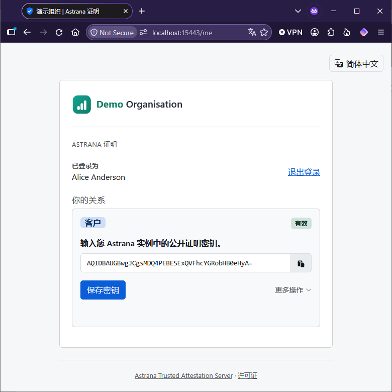
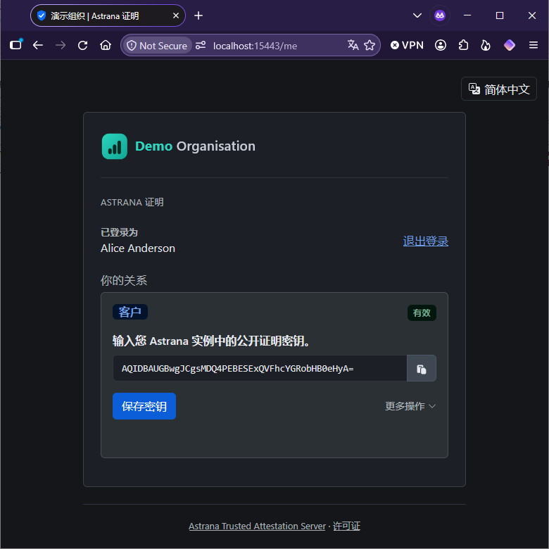
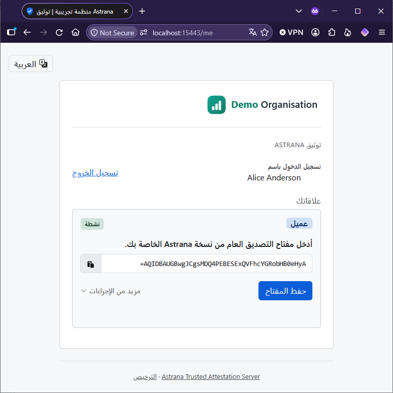
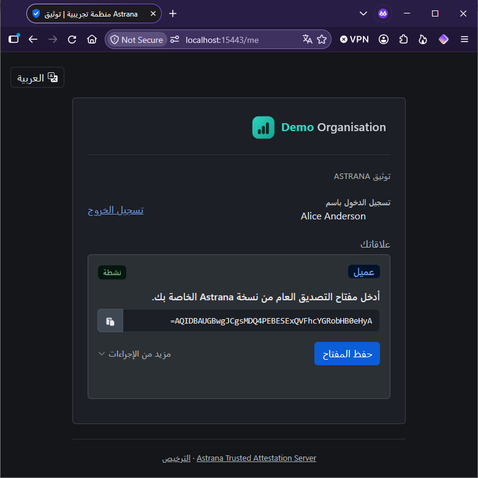

# Installing the .NET implementation

The .NET implementation is for any organisation that prefers .NET. It runs on ASP.NET Core 10 with its built-in web
server, Kestrel.

You can install it behind Internet Information Services (IIS) on Windows or Nginx on Linux, or run it as the Docker
container image `astrana/ata-dotnet`, which listens on port 8080 inside the container. It is well suited to and aligned
with enterprises and government departments. They usually have a central identity and access management system, a
database team and change control, and the steps below are written for that setting.

**Installation has five steps:**

1. Register the server with your identity system.
2. Create an empty database.
3. Write the configuration.
4. Run the server and confirm it works.
5. Grant, revoke and extend relationships from your own systems.

The server creates its own schema on first run, or your database team applies it. There is no administrator interface.
After installation, your own systems of record grant, revoke and extend relationships by calling procedures in the
database.

## Container or server

You can run the server in one of two ways. Only Step 4, running it, differs between them. Choose the one that fits how
your organisation already runs services.

- **As a Docker container.** You pull the published image and run it behind a reverse proxy that holds the certificate.
  This suits an organisation that already runs containers, under Docker, Kubernetes or a cloud container service,
  because nothing is installed on the host and an update is a new image.
- **Installed on a server.** You build the application from this repository and run it under IIS on Windows, or as a
  service behind Nginx on Linux. This suits an organisation that runs .NET applications on servers it manages, or whose
  change control approves software installed on hosts rather than container images.

## Before you start

You need four things:

- An identity and access management system that supports OpenID Connect or SAML 2.0 and already knows every person you
  intend to grant a relationship to. Microsoft Entra ID, Active Directory Federation Services, Keycloak, Okta,
  PingFederate and the other enterprise systems all qualify. This page calls it the identity system. The
  [identity systems](../identity-systems.md) page lists the ones tested with the server and what to check in yours.
- A database server, Microsoft SQL Server, PostgreSQL, or MySQL, with an empty database on it.
- Somewhere to run the server, with a TLS certificate for the address that members and verifying Astrana instances will
  use, or a reverse proxy that terminates TLS in front of it.
- To build it, the .NET 10 software development kit, or Docker.

## Step 1. Register the server with your identity and access management system

Create a client for the server. Some systems call it an application or a relying party. Register the addresses below
exactly as written, with your own host name.

| Protocol       | Addresses to register                                                                                                                                                                                                 |
| -------------- | --------------------------------------------------------------------------------------------------------------------------------------------------------------------------------------------------------------------- |
| OpenID Connect | Redirect address `https://your-server/signin-oidc`. Post-logout redirect address `https://your-server/signout-callback-oidc`.                                                                                         |
| SAML           | Assertion consumer address `https://your-server/Saml2/Acs`. Service provider metadata at `https://your-server/Saml2`. Single logout address `https://your-server/Saml2/Logout`, used only with a signing certificate. |

### OpenID Connect

Make the client confidential, using the authorisation code flow. Record the issuer address, the client identifier and
the client secret.

### SAML

The server is a service provider. It publishes its own metadata at the address above, which your identity system can
import. Record the identity provider's metadata address and entity identifier.

Give the server a signing certificate and private key of its own, as a PKCS#12 file. Most identity systems require
signed authentication requests, and single logout always does. Without a certificate the server can sign members in only
through an identity system that does not ask for signed requests, and single logout is not available. To generate a
throwaway pair for testing, run the commands below with your own host name in place of the example. On Windows, run them
in Git Bash, which comes with Git for Windows and includes OpenSSL. `MSYS_NO_PATHCONV=1` at the start stops Git Bash
rewriting `/CN=...` as a Windows path, and does nothing elsewhere.

```bash
MSYS_NO_PATHCONV=1 openssl req -x509 -newkey rsa:3072 -sha256 -nodes -days 1095 -subj "/CN=attest.example.org" \
  -keyout sp.key -out sp.crt
openssl pkcs12 -export -inkey sp.key -in sp.crt -out sp.pfx -passout pass:change-this
```

Record the service provider's entity identifier. It must match what the identity system has on record exactly.

Signing out can end the session at the identity system as well, over SAML single logout. That needs three things:

- The signing certificate above.
- A single logout endpoint advertised in the identity system's metadata.
- The server's single logout address from the table above, registered with the identity system.

Without all three, signing out ends the session at the server only. Without the signing certificate, the server also
leaves its single logout address out of its metadata and answers a logout request the identity system sends with HTTP
404 - Not Found, leaving the member signed in.

### Which claim identifies the member

You grant a relationship to an identifier before the member has ever signed in. The server matches the member to it when
they sign in. The identifier therefore has to be one you already hold for each person, and one the identity system
presents every time.

By default the server uses the OpenID Connect `sub` claim or the SAML NameID. In most organisations the identifier your
system of record holds is something else, such as an employee number, a directory object identifier or a user principal
name, and the identity system exposes it on another claim. In that case you configure that claim in Step 3.

A persistent NameID that the identity system creates itself will not work. It is a pseudonym created at first sign-in,
so you cannot know it in advance.

### Who you are trusting

The server trusts the identity system completely. Whoever can change its claim mapping can sign in as any member and
register, clear, revoke or remove that member's relationships and keys. They cannot grant, extend or restore a
relationship. Put the client's registration and claim mapping under the same change control as the rest of the identity
system.

### Values you now have

- The issuer address, client identifier and client secret, for OpenID Connect.
- The identity provider's metadata address and entity identifier, your entity identifier, and the PKCS#12 file and its
  password, for SAML.
- The name of the claim that identifies the member, if it is not the default.

## Step 2. Create the database

Create an empty database and a login for the application. On first run the server applies the schema for your engine
from `shared/schema`. It creates two tables, their indexes and five stored procedures, and nothing else. The login
therefore needs the right to create tables and procedures in that database. Keep the database for the server's own
tables only. The commands below create the database and the login, with `...` in place of a password you choose.

### SQL Server

```sql
CREATE DATABASE trusted_attestation;
GO
CREATE LOGIN ata_application WITH PASSWORD = '...';
USE trusted_attestation;
CREATE USER ata_application FOR LOGIN ata_application;
ALTER ROLE db_owner ADD MEMBER ata_application;
```

Set `Database:Provider` to `SqlServer` and the connection string to
`Server=db.example.org;Database=trusted_attestation;User Id=ata_application;Password=...;Encrypt=True`. Give SQL Server
a certificate the application trusts. `TrustServerCertificate=True` skips that check and belongs only in development.

### PostgreSQL

```sql
CREATE ROLE ata_application LOGIN PASSWORD '...';
CREATE DATABASE trusted_attestation OWNER ata_application;
```

Set `Database:Provider` to `PostgreSql` and the connection string to
`Host=db.example.org;Database=trusted_attestation;Username=ata_application;Password=...;SSL Mode=VerifyFull`. Give
PostgreSQL a certificate the application trusts. `SSL Mode=VerifyFull` encrypts the connection and checks the
certificate and the host name.

### MySQL

```sql
CREATE DATABASE trusted_attestation CHARACTER SET utf8mb4;
CREATE USER 'ata_application'@'%' IDENTIFIED BY '...';
GRANT ALL PRIVILEGES ON trusted_attestation.* TO 'ata_application'@'%';
```

Set `Database:Provider` to `MySql` and the connection string to
`Server=db.example.org;Port=3306;Database=trusted_attestation;User Id=ata_application;Password=...;SslMode=VerifyFull`.
Give MySQL a certificate the application trusts. `SslMode=VerifyFull` encrypts the connection and checks the certificate
and the host name.

### A hardened deployment

With the login above, the application can call every procedure, so anyone who broke into the server could grant, extend
or restore relationships. A hardened deployment closes that gap. It keeps the application away from the procedures that
grant, revoke and extend relationships.

1. Apply the schema file yourself.
2. Set `Database:CreateSchemaOnStartup` to `false` in Step 3.
3. Create the two database roles the schema file describes in its comments.
4. Run the server as the application's role, and connect your own tooling as the organisation's role.

The application's role may read and delete relationship rows, update a relationship's key, insert into the audit log,
and execute two procedures, the member's own revoke and the procedure that deletes old audit entries. It must not be
able to call the grant, revoke and extend procedures, or write the columns only the organisation may change, which are
the type, the subtype, the revocation and the expiry. The organisation's role may execute those three procedures and
nothing else.

Each engine has its own points to get right. Most mistakes here produce no error, only a weaker boundary.

- On SQL Server, the boundary relies on ownership chaining, so the procedures and the tables must have the same owner.
  That holds when one login applies the whole schema file into one schema. In any more complex setup, check it.
- On PostgreSQL, revoke `EXECUTE` on all five procedures from `PUBLIC` before granting, as the schema file shows.
  PostgreSQL grants it to every role by default, so until it is revoked any login can call the organisation's three
  procedures.
- On PostgreSQL, keep every procedure marked `SECURITY DEFINER` with its fixed search path, as the schema file has them.
  Without them the application's role would need direct table grants, and the boundary is gone.
- On PostgreSQL, the application's role also needs `USAGE` on the `audit_log_id_seq` sequence. Without it the first key
  registration fails, so unlike the other mistakes, this one shows at once.
- On MySQL, the procedures run with the rights of the user who created them, so apply the schema as a separate
  administrative account that holds the table rights, and run the application as a new account that holds only what the
  schema file lists. To keep the Step 2 account for the application instead, make sure the administrative account
  created the procedures, because a procedure created by the Step 2 account would lose its table rights too. Then run
  `REVOKE ALL PRIVILEGES ON trusted_attestation.* FROM 'ata_application'@'%';` before the narrow grants, because they
  add to what an account already holds. Where you can, name the host the application connects from in place of `'%'`,
  which accepts the account from any host.

To check the grants, run `shared/test/role-checks.py` against a copy of the database. It creates two roles of its own,
gives them the grants the schema file documents, and reports what each can and cannot do. Pass the engine with
`--database`, as `postgres`, `mysql` or `mssql`. Pass `--sql-command` with a command that reads SQL from standard input
and runs it as an administrator. On MySQL, also pass `--as-application-command` and `--as-organisation-command`, each
with a command that runs SQL as one of the script's two roles, because MySQL cannot drop privileges within a session.
`python shared/test/role-checks.py --help` names the two roles and their password. The script changes the database it
runs against, so never point it at the live one. Once its report shows what you expect, give your own roles the same
grants.

## Step 3. Configure the server

Settings live in `appsettings.json` next to the application, under the `TrustedAttestation` section. Environment
variables work too, written as `TrustedAttestation__Section__Key`. Manifest fields given per locale are nested objects,
so the organisation's English name is `TrustedAttestation__Manifest__Name__en`. Lists are indexed, as in
`TrustedAttestation__Manifest__RelationshipTypes__0`.

The settings include the database password and the client secret. Make the file readable by the service's account alone,
and the environment file too if you use one.

The manifest settings are public and are served to anyone who asks. Everything else is private. The server builds the
manifest from a fixed list of the public fields, never from the configuration as a whole, so a private value cannot
reach it.

### A complete configuration

```json
{
  "TrustedAttestation": {
    "Database": {
      "Provider": "SqlServer",
      "ConnectionString": "Server=db.example.org;Database=trusted_attestation;User Id=ata_application;Password=...;Encrypt=True"
    },
    "Iam": {
      "Protocol": "Oidc",
      "Authority": "https://login.example.org/realms/staff",
      "ClientId": "trusted-attestation",
      "ClientSecret": "..."
    },
    "Tls": { "TerminatedByProxy": true },
    "Manifest": {
      "DefaultLocale": "en",
      "Name": { "en": "Example Organisation" },
      "Description": { "en": "Attestations for Example Organisation staff and clients" },
      "Website": { "en": "https://www.example.org/" },
      "PrivacyNoticeUrl": { "en": "https://www.example.org/privacy" },
      "RelationshipTypes": ["employee", "client"],
      "EnrollmentUrl": "https://ata.example.org/",
      "AttestationUrl": "https://ata.example.org/api/v1/attest"
    }
  }
}
```

### Database

| Setting                    | Key                              | Default and notes                                      |
| -------------------------- | -------------------------------- | ------------------------------------------------------ |
| Engine                     | `Database:Provider`              | `PostgreSql`. The others are `MySql` and `SqlServer`   |
| Connection                 | `Database:ConnectionString`      | Required                                               |
| Create schema on first run | `Database:CreateSchemaOnStartup` | `true`. Set `false` when you apply the schema yourself |

### Identity system

| Setting                | Key                                                                         | Default and notes                                                                                                                                                                  |
| ---------------------- | --------------------------------------------------------------------------- | ---------------------------------------------------------------------------------------------------------------------------------------------------------------------------------- |
| Protocol               | `Iam:Protocol`                                                              | `Oidc`. The other value is `Saml`                                                                                                                                                  |
| OpenID Connect issuer  | `Iam:Authority`                                                             | Required under OpenID Connect                                                                                                                                                      |
| Client identifier      | `Iam:ClientId`                                                              | Required under OpenID Connect                                                                                                                                                      |
| Client secret          | `Iam:ClientSecret`                                                          | Required under OpenID Connect                                                                                                                                                      |
| Subject claim          | `Iam:SubjectClaim`                                                          | `sub`. See Step 1                                                                                                                                                                  |
| Display name claim     | `Iam:NameClaim`                                                             | `name`. When your identity system sends no display name, the server shows the subject identifier                                                                                   |
| Extra scopes           | `Iam:AdditionalScopes`                                                      | None. A list, added to `openid`, `profile` and `email`                                                                                                                             |
| HTTPS discovery        | `Iam:RequireHttpsMetadata`                                                  | `true`. Refuses a discovery document served over plain HTTP                                                                                                                        |
| Claims from UserInfo   | `Iam:GetClaimsFromUserInfoEndpoint`                                         | `true`. Also reads the claims your identity system sends from its UserInfo endpoint, for one that puts the subject, display name or locale claim there rather than in the ID token |
| SAML entity identifier | `Iam:Saml:EntityId`                                                         | Required under SAML                                                                                                                                                                |
| SAML identity provider | `Iam:Saml:IdentityProviderMetadataUrl`, `Iam:Saml:IdentityProviderEntityId` | Required under SAML                                                                                                                                                                |
| SAML signing key       | `Iam:Saml:SigningCertificatePath`, `Iam:Saml:SigningCertificatePassword`    | None. The PKCS#12 file from Step 1. A relative path is resolved against the application folder                                                                                     |

Use `https://` addresses for the identity system. `Iam:RequireHttpsMetadata` exists for development against a local
identity provider and stays `true` in a deployment. Under SAML the server does not refuse a plain HTTP metadata address,
so check it yourself. If your identity system uses a certificate from a private authority, trust that authority in the
operating system's certificate store. The server has no setting to skip certificate validation.

### TLS

The server refuses to run without TLS. Either it holds the certificate itself, or a proxy in front of it does and you
set `Tls:TerminatedByProxy` to `true`.

| Setting                          | Key                                               | Default and notes                                      |
| -------------------------------- | ------------------------------------------------- | ------------------------------------------------------ |
| Terminated by a proxy            | `Tls:TerminatedByProxy`                           | `false`. Set `true` when a proxy holds the certificate |
| Its own certificate              | `ASPNETCORE_URLS`, `Kestrel:Certificates:Default` | An `https://` address and a Kestrel certificate        |
| Strict-Transport-Security header | `Tls:HstsEnabled`                                 | `true`. One year, no subdomains                        |

`Kestrel:Certificates:Default` sits at the root of the configuration, not under `TrustedAttestation`.

Behind a proxy, the server trusts the forwarded scheme and host headers the proxy sets, and refuses a request unless its
`X-Forwarded-Proto` header holds exactly one value, `https`. It still serves a request without the header. Put the
server on a network only the proxy can reach. The proxy sets the minimum TLS version. When the server holds the
certificate itself, it serves TLS 1.2 or later.

The Strict-Transport-Security header tells a browser to use only HTTPS for your address for a year. The server never
sends it to a loopback address, `localhost`, `127.0.0.1` or `[::1]`. To cover subdomains or ask for preload, set the
header at your proxy instead and turn the server's off, so that the browser receives one header rather than two.

### Audit retention

The audit log keeps an entry for every change to a relationship. The server itself removes entries older than the
retention period. Nothing else has to be scheduled.

| Setting      | Key                   | Default and notes                                                                                   |
| ------------ | --------------------- | --------------------------------------------------------------------------------------------------- |
| Retention    | `Audit:RetentionDays` | `1825`, which is five years. From 1 to 36,500 days                                                  |
| When it runs | `Audit:RunAt`         | `02:00`, a time of day in server time                                                               |
| On or off    | `Audit:PruneEnabled`  | `true`. Set `false` if your own job prunes, connected as a login that may execute `prune_audit_log` |

Under IIS, an application pool that stops when idle may not be running at the time `Audit:RunAt` sets, and then nothing
is pruned. Keep the pool running, choose a time when it runs, or set `Audit:PruneEnabled` to `false` and prune from your
own job.

### The manifest

The manifest is public. A verifying Astrana instance reads it to find your attestation endpoint and to show its owner
who you are. Its keys sit under `Manifest`. Give each text field once for each locale. Where a field has no entry for a
locale, the default locale's entry is used.

| Field                | Key                        | Required and notes                                                                                   |
| -------------------- | -------------------------- | ---------------------------------------------------------------------------------------------------- |
| Organisation name    | `Name`                     | Required, per locale                                                                                 |
| Description          | `Description`              | Optional, per locale                                                                                 |
| Website              | `Website`                  | Optional, per locale                                                                                 |
| Privacy notice       | `PrivacyNoticeUrl`         | Optional, per locale                                                                                 |
| Support page         | `SupportUrl`               | Optional, per locale. The page a member who holds no relationship yet is sent to                     |
| Logo                 | `LogoData`, `LogoDataDark` | Optional. A file path or a `data:` URI, see below. The dark logo needs the light one                 |
| Jurisdictions        | `Jurisdictions`            | Optional. ISO 3166-1 country or ISO 3166-2 subdivision codes for where you operate or are registered |
| Relationship types   | `RelationshipTypes`        | Required, at least one, from `shared/contract/relationship-types.json`                               |
| Landing page address | `EnrollmentUrl`            | Required. Where members sign in, normally the server's own root address                              |
| Attestation endpoint | `AttestationUrl`           | Required. The server's `/api/v1/attest`                                                              |
| Default locale       | `DefaultLocale`            | `en`                                                                                                 |
| Offered locales      | `SupportedLocales`         | Empty, which offers every locale that ships. Private, see Localisation                               |

The logo is embedded in the manifest as a `data:` URI. Give either the URI itself, or the path to a PNG, JPEG, GIF, WebP
or SVG file, which the server reads and encodes when it starts. A relative path is resolved against the application
folder. Keep the data URI to 65,536 characters or fewer, about 48 kilobytes of image, because every verifying Astrana
instance downloads it. The manifest schema sets that limit.

The manifest's version, `Manifest:ManifestVersion`, is always `1` and needs no setting. Any other value stops the
server.

The server validates the whole manifest when it starts. It refuses to run in any of these cases.

- A required field is missing.
- An address is not an absolute `https://` address.
- A locale is not written as a language tag, such as `en` or `fr-CA`.
- A field given per locale has no entry for the default locale.
- An entry in a field given per locale is empty.
- A relationship type is not in the vocabulary, or is listed twice.
- A jurisdiction is not written as an ISO 3166 code, or is listed twice.
- A logo is not a base64 image data URI, or is over 65,536 characters.
- A dark logo is given without a light one.
- A logo file cannot be read.

### Localisation

The pages ship in 58 locales, from `shared/ui/ui-strings.json`. Where a locale has no translation for a string, the page
shows the English one. The translations were drafted by machine, so have a native speaker read the ones your members
will see before you go live. [Reviewing a translation](../../CONTRIBUTING.md#reviewing-a-translation) explains how to
make a review sheet and send corrections. Arabic, Hebrew, Persian, Urdu and Pashto are laid out right to left.

The server picks a request's locale from these sources, in this order:

1. The language the member picked with the switcher at the top of the page.
2. A `locale` claim from your identity system.
3. The browser's Accept-Language list, in full. A region such as `fr-CA` falls back to its language.
4. Your default locale.

`Manifest:SupportedLocales` is the ordered list of locales the pages offer. Leave it empty to offer every locale that
ships, in alphabetical order of each language's own name with your default locale first. The list limits every source
above, not only the switcher. The server skips a claim or browser preference that is not on the list and tries the next
source. A listed locale that does not ship is ignored. The switcher appears only when more than one locale remains. The
setting sits under `Manifest` but is not published in the manifest.

<p>
  
  
</p>

<p>
  
  
</p>

The server never translates your own text. Give the organisation's name, description, website, privacy notice and
support page in every locale you offer. If you leave one out, members see that text in the default locale on a page that
is otherwise translated.

### Branding

The pages come in light and dark, and follow the member's own device setting, with no switch on the page. Give a dark
logo as well as the light one in the manifest, or the light logo is shown in both. A colour that should differ between
the two goes in the matching block of `theme-overrides.css`, as its examples show.

Your name and logo come from the manifest. Colours and fonts come from `theme-overrides.css` in the published `wwwroot`
folder. It ships as commented examples, each saying what it controls. Uncomment one, change its value, and it applies
the next time a page loads, with no rebuild. Keep the contrast at 4.5:1 for text and 3:1 for large text and controls.
Those are the levels the Web Content Accessibility Guidelines (WCAG) 2.1 AA set, and the pages are built to meet them.

To change the favicon, replace `wwwroot/favicon.svg`. Publishing a new release overwrites both files with the shipped
copies, so keep your own and put them back after each update. In the container, mount your own copies at
`/app/wwwroot/theme-overrides.css` and `/app/wwwroot/favicon.svg`.

## Step 4. Run it

The server will not start in any of these cases, and its log says which one.

- TLS is not configured.
- It cannot reach the database.
- The schema is missing while creation at start-up is off.
- It cannot fetch the OpenID Connect discovery document.
- The manifest fails one of the checks listed under The manifest in Step 3.
- The SAML signing certificate cannot be read.

Two mistakes only show when the first member signs in. One is a wrong client secret. The other, under SAML, is a wrong
metadata address, because the server fetches the metadata then.

### As a container

Pull the published image, naming the full version of the release you want. Each release has three tags. One is the full
version, such as `1.0.0`. One is the major and minor version, such as `1.0`. The third is `latest`. The image is built
for 64-bit Intel and AMD processors (amd64) only.

```bash
docker pull astrana/ata-dotnet:1.0.0
```

On any other processor, or to build it yourself, build the image from the repository root instead.

```bash
docker build -f dotnet/Dockerfile -t astrana/ata-dotnet:1.0.0 .
```

The licences and copyright notices for the third-party software in the image are in `/app/THIRD-PARTY-NOTICES.txt`. The
server also serves that file at `/THIRD-PARTY-NOTICES.txt`, and the licence page links to it.

Put the settings in an environment file. The container holds no certificate, so the file includes
`TrustedAttestation__Tls__TerminatedByProxy=true`. Run the container on a port only your proxy can reach. You can mount
`appsettings.json` at `/app/appsettings.json` instead of using the environment file.

```bash
docker run -d --name ata --restart unless-stopped --env-file ata.env -p 127.0.0.1:8080:8080 astrana/ata-dotnet:1.0.0
```

Put a TLS-terminating proxy in front. The proxy must set `X-Forwarded-Proto` and `X-Forwarded-Host` itself, from the
request it received, and replace any the client sent. The server trusts these headers when `Tls:TerminatedByProxy` is
`true`. A client that could set them could choose the scheme and host the server uses to build its addresses. The server
ignores `X-Forwarded-Port`, `X-Forwarded-Prefix`, `X-Forwarded-Ssl` and the `Forwarded` header of Request for Comments
(RFC) 7239. The configurations below remove those four as well, so nothing further along can be misled by them.

With Caddy, this is the whole configuration. Caddy obtains and renews the certificate itself, and it sets
`X-Forwarded-Proto`, `X-Forwarded-Host` and `X-Forwarded-For` from the request it received and overwrites what the
client sent. It leaves the other four headers alone, so the four `header_up` lines remove them.

```
ata.example.org {
    reverse_proxy 127.0.0.1:8080 {
        header_up -Forwarded
        header_up -X-Forwarded-Port
        header_up -X-Forwarded-Prefix
        header_up -X-Forwarded-Ssl
    }
}
```

With Nginx, terminate TLS in the server block and forward with these lines. `proxy_set_header` replaces a header the
client sent with the proxy's own value, and an empty value removes the header.

```nginx
location / {
    proxy_pass http://127.0.0.1:8080;
    proxy_set_header Host $host;
    proxy_set_header X-Forwarded-Proto $scheme;
    proxy_set_header X-Forwarded-Host $host;
    proxy_set_header X-Forwarded-For $remote_addr;
    proxy_set_header Forwarded "";
    proxy_set_header X-Forwarded-Port "";
    proxy_set_header X-Forwarded-Prefix "";
    proxy_set_header X-Forwarded-Ssl "";
}
```

With another proxy, do the same with its own directives. The container must reach your database and your identity system
by the addresses in its configuration. The identity system must be able to redirect members back to the address your
proxy serves. The demonstration in `dotnet/demo` is a complete working example of a container behind a proxy, with a
database and an identity system you would replace with your own.

#### Verify the image

Each published image is signed through Sigstore by the release workflow of the Astrana Trusted Attestation Server
repository, with a short-lived certificate rather than a long-lived key. To check that the image you pulled is the one
that workflow built, install [cosign](https://docs.sigstore.dev/cosign/system_config/installation/), version 3 or later,
and run this command. It prints the signature's details when the image is genuine and fails when it is not. In this
command and the ones below, put the release's full version, such as `1.0.0`, in place of `<version>`.

```bash
cosign verify astrana/ata-dotnet:<version> \
  --certificate-identity-regexp '^https://github\.com/astrana-project/astrana-trusted-attestation-server/\.github/workflows/release\.yml@refs/heads/master$' \
  --certificate-oidc-issuer https://token.actions.githubusercontent.com
```

The image also comes with a record of how it was built and, in every release after 1.0.0, a list of the software it
contains. The signature covers both, and Docker shows them. A 1.0.0 image is signed but comes with no list of software,
so for it the second command prints `{}`.

```bash
docker buildx imagetools inspect astrana/ata-dotnet:<version> --format '{{ json .Provenance }}'
docker buildx imagetools inspect astrana/ata-dotnet:<version> --format '{{ json .SBOM }}'
```

Each GitHub release includes the software bill of materials, `sbom.json`. Every release after 1.0.0 also includes its
signature, `sbom.json.sigstore.json`. Download both from the release and check them the same way.

```bash
curl -LO https://github.com/astrana-project/astrana-trusted-attestation-server/releases/download/dotnet-v<version>/sbom.json
curl -LO https://github.com/astrana-project/astrana-trusted-attestation-server/releases/download/dotnet-v<version>/sbom.json.sigstore.json
cosign verify-blob sbom.json --bundle sbom.json.sigstore.json \
  --certificate-identity-regexp '^https://github\.com/astrana-project/astrana-trusted-attestation-server/\.github/workflows/release\.yml@refs/heads/master$' \
  --certificate-oidc-issuer https://token.actions.githubusercontent.com
```

The 1.0.0 releases have no `sbom.json.sigstore.json`, because this repository's GitHub releases can't take new files
once they're published. Check a 1.0.0 bill of materials with the [GitHub CLI](https://cli.github.com/) instead, signed
in to any GitHub account. It confirms that the file is the one published in that release.

```bash
curl -LO https://github.com/astrana-project/astrana-trusted-attestation-server/releases/download/dotnet-v1.0.0/sbom.json
gh release verify-asset dotnet-v1.0.0 sbom.json --repo astrana-project/astrana-trusted-attestation-server
```

### Installed on a server

Building needs the .NET 10 software development kit. Running needs the ASP.NET Core 10 runtime.

```bash
dotnet publish dotnet/src/Astrana.TrustedAttestation.Server -c Release -o /opt/ata
```

Write your settings to `/opt/ata/appsettings.json` or to the service's environment.

On Linux, run `dotnet /opt/ata/Astrana.TrustedAttestation.Server.dll` as a systemd service with
`ASPNETCORE_URLS=http://127.0.0.1:5000` in its environment, behind Nginx. Nginx holds the certificate and forwards to
that address with the `location` block shown for the container, with `5000` in place of `8080`.

On Windows, host the published folder under IIS with the ASP.NET Core Module, and bind the site to HTTPS only. IIS
passes on any header a client sends, so the published folder includes a `web.config` that does what a proxy would. It
sets `X-Forwarded-Proto` and `X-Forwarded-Host` from the scheme and host IIS received, whatever the client sent. It
empties `X-Forwarded-For`, `X-Forwarded-Port`, `X-Forwarded-Prefix`, `X-Forwarded-Ssl` and `Forwarded`. It also removes
the `X-Powered-By` header IIS adds. A request that reaches IIS over plain HTTP is refused with HTTP 421 - Misdirected
Request.

The `web.config` needs the IIS URL Rewrite module. URL Rewrite changes request headers through server variables, and
`web.config` allows the ones it sets in its own `allowedServerVariables` section. URL Rewrite locks that section by
default, and until it is unlocked, every request gets HTTP 500.19, the IIS configuration error. As an administrator,
unlock it for your site, with your site's name in place of `Your Site`:

```bat
%windir%\system32\inetsrv\appcmd.exe unlock config "Your Site" -section:system.webServer/rewrite/allowedServerVariables /commit:apphost
```

`%windir%` works only in Command Prompt. In PowerShell, start the line with
`& "$env:windir\system32\inetsrv\appcmd.exe"` instead.

To keep the setting at server level instead, allow the seven server variables listed in `web.config` there, and remove
the `allowedServerVariables` element from `web.config`.

On both Linux and Windows, set `Tls:TerminatedByProxy` to `true`. To have Kestrel hold the certificate itself instead,
set an `https://` address in `ASPNETCORE_URLS` and the certificate under `Kestrel:Certificates:Default`.

### Confirm it works

- `https://your-server/.well-known/ata-manifest.json` returns your manifest, with nothing private in it.
- `https://your-server/` offers sign-in through your identity system. A member who has been granted nothing sees a page
  saying that nothing has been added for them yet. The page links to your support page, or to your website if you set no
  support page.
- The attestation endpoint answers `{"valid":false}` and nothing else for a key it does not hold. Any 32 bytes in base64
  will do.

```bash
curl -s https://your-server/api/v1/attest -H "Content-Type: application/json" -d '{"public_key":"AAAAAAAAAAAAAAAAAAAAAAAAAAAAAAAAAAAAAAAAAAE="}'
```

## Step 5. Grant, revoke and extend relationships from your systems

A member has no relationships until you grant them. The server has no page and no endpoint for granting, revoking or
extending. Your own systems do all three by calling procedures in the database, connected as the organisation's role. In
practice that is a feed from the system of record, such as the human resources system for staff or the customer or case
system for clients. Run it as a scheduled job under that system's change control, so that a relationship ends in the
server when it ends in the record.

| Procedure                    | Arguments                                                        | Effect                                                                                                                                                                   |
| ---------------------------- | ---------------------------------------------------------------- | ------------------------------------------------------------------------------------------------------------------------------------------------------------------------ |
| `grant_member_relationship`  | subject identifier, relationship type, subtype or null, actor    | Creates the relationship, with no key yet. Fails if it already exists, if the type is not in the vocabulary, or if the subject identifier has leading or trailing spaces |
| `revoke_member_relationship` | subject identifier, relationship type, actor                     | Marks it revoked. The row stays, so it can be restored. Fails if there is no such relationship                                                                           |
| `extend_member_relationship` | subject identifier, relationship type, new expiry or null, actor | Clears a revocation, sets or clears the expiry, restores an expired relationship. Fails if there is none                                                                 |

The subject identifier is the value of the subject claim you configured. You need it before the member signs in, because
you grant the relationship to it. The actor is free text naming who or what made the change, and goes into the audit
log.

Four rules apply to the calls.

- On SQL Server, call the procedures with `EXEC`. On PostgreSQL and MySQL, use `CALL`.
- MySQL requires every argument, null included.
- Call each procedure on its own, outside any transaction your tooling opens. On MySQL a procedure starts its own
  transaction, which commits any transaction already open.
- An expiry is a moment in Coordinated Universal Time (UTC). A date on its own means midnight at the start of that day.
  On PostgreSQL the expiry carries a time zone, and a value written without an offset is read in the session's time
  zone, so give the offset, as in `'2027-04-01 00:00:00+00'`.

When the member signs in, the relationship is there, waiting for their key.

<p>
  
  
</p>

A member whose relationship is revoked can still sign in and register a key. The relationship stays revoked until you
extend it. A member can revoke a relationship themselves, which only you can undo. A member can also remove a
relationship entirely, after which only a new grant brings it back.

## Keeping it running

- Back up the database as you would any other. Everything the server holds is in its two tables.
- Point your load balancer's or monitoring system's health probe at `/.well-known/ata-manifest.json`. It needs no
  sign-in and is cheap to serve. A server that answers it passed every start-up check, apart from the SAML metadata,
  which is fetched at the first sign-in. The probe does not touch the database. If you need a dependency check, probe
  the attestation endpoint with a key you registered for that purpose.
- Set the audit retention to match your records policy. Every grant, revoke, extension, key registration, key clearing,
  removal and member's own revoke is in the log, with the member's subject identifier. For the organisation's own
  changes, the log also holds the actor your tooling passed. Keys and attestation lookups are never written to it, so
  your auditors can read it without seeing anything a member or a verifying Astrana instance has not already seen.
- New versions come as new releases of this implementation. [Versions and releases](../versions.md) says what each
  number means and what to read before you update, including any schema change you apply by hand.
- Report a security problem privately, as [SECURITY.md](../../SECURITY.md) describes.
