# Quick start

Run the Astrana Trusted Attestation Server on your local development computer in a few minutes. Each implementation
ships a demonstration stack with the application, its database, a TLS-terminating proxy and a throwaway identity
provider. One command starts it.

The demonstration is for your own machine, and nothing in it is a starting point for a real deployment. Its identity
provider, Keycloak, runs in development mode. It has no TLS, an embedded database that vanishes with the container, and
an administrator account, `admin` with password `admin`, created from environment variables anyone can read. That is
right for a throwaway on your own machine and wrong anywhere else.

The demonstration publishes its ports on every network address of your computer, so other machines on your network can
reach its identity provider. Run it only on a network you trust, or block its ports from other machines with a firewall,
and never point real users at it. Do not limit the identity provider's port to `127.0.0.1` in the compose file. On
Docker Engine on Linux that breaks sign-in, because the application reaches the identity provider through
`host.docker.internal`, which is your computer's address on the Docker network.

## What you need

- Docker, with Compose. Docker Desktop includes both.
- This repository, cloned locally.
- A few gigabytes of free disk space for the images the first time.
- `openssl`, to make a key to register. Linux and macOS have it, and Git for Windows includes it.

## Start one implementation

Choose one. All three publish the demonstration identity provider on port 8081, so run one at a time.

| Implementation        | Start                                                         | Then open               |
| --------------------- | ------------------------------------------------------------- | ----------------------- |
| .NET, with SQL Server | `docker compose -f dotnet/demo/docker-compose.yml up --build` | https://localhost:15443 |
| Java, with PostgreSQL | `docker compose -f java/demo/docker-compose.yml up --build`   | https://localhost:16443 |
| PHP, with MySQL       | `docker compose -f php/demo/docker-compose.yml up --build`    | https://localhost:17443 |

The .NET demonstration runs Microsoft's free SQL Server Developer edition, whose licence allows it for development,
testing and demonstration but not production. Starting it accepts the
[SQL Server Developer licence terms](https://go.microsoft.com/fwlink/?linkid=857698). Everything else in the
demonstrations is open source.

The first start takes a few minutes. The images are pulled, the application is built, and the identity provider loads
its demonstration members. The .NET and Java applications refuse to start until they can reach the identity provider, so
they restart a few times while it comes up. The PHP application refuses requests until then. This is expected.

When the stack is up, open the address for your implementation. Your browser warns about the certificate, because the
demonstration issues its own from a local certificate authority your browser does not trust. Accept it.

The rest of this guide uses the .NET addresses and commands. For Java or PHP, use that implementation's port and compose
file.

The pages come in light and dark, and follow your device's setting.

<p>
  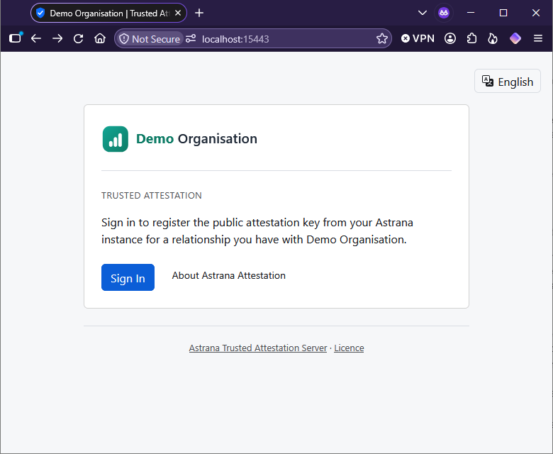
  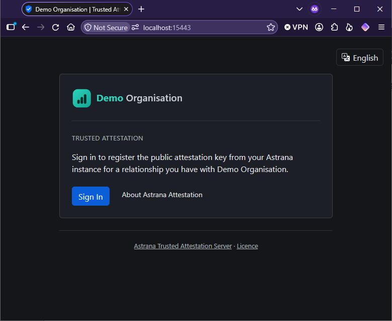
</p>

Signing in goes through Keycloak, an open-source identity provider, which the demonstration sets up with the four
members below.

<p>
  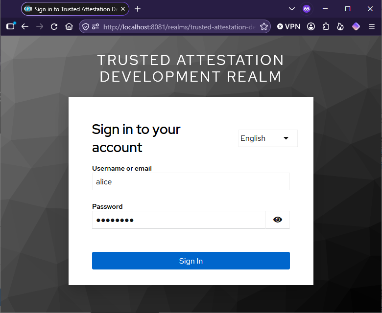
  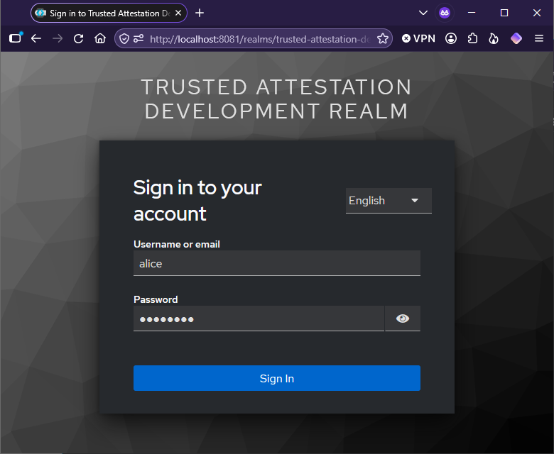
</p>

## What the demonstration already holds

When it first starts, the demonstration grants a few relationships the way an organisation's own systems would, so there
is something to see at once. Every member's password is `password`.

| Member  | Relationships                                                                                    |
| ------- | ------------------------------------------------------------------------------------------------ |
| `alice` | Employee, waiting for a key. Client, active. Licensed professional, revoked by the organisation. |
| `bob`   | Employee, active.                                                                                |
| `carol` | Client, expired on 1 January 2026.                                                               |
| `dave`  | None, which shows the page a member sees before anything is granted.                             |

Sign in as `alice` to see three statuses on one page, and as `carol` to see the fourth. The keys behind the active,
revoked and expired relationships are samples the demonstration added. In real use, the member's own Astrana instance
generates them.

<p>
  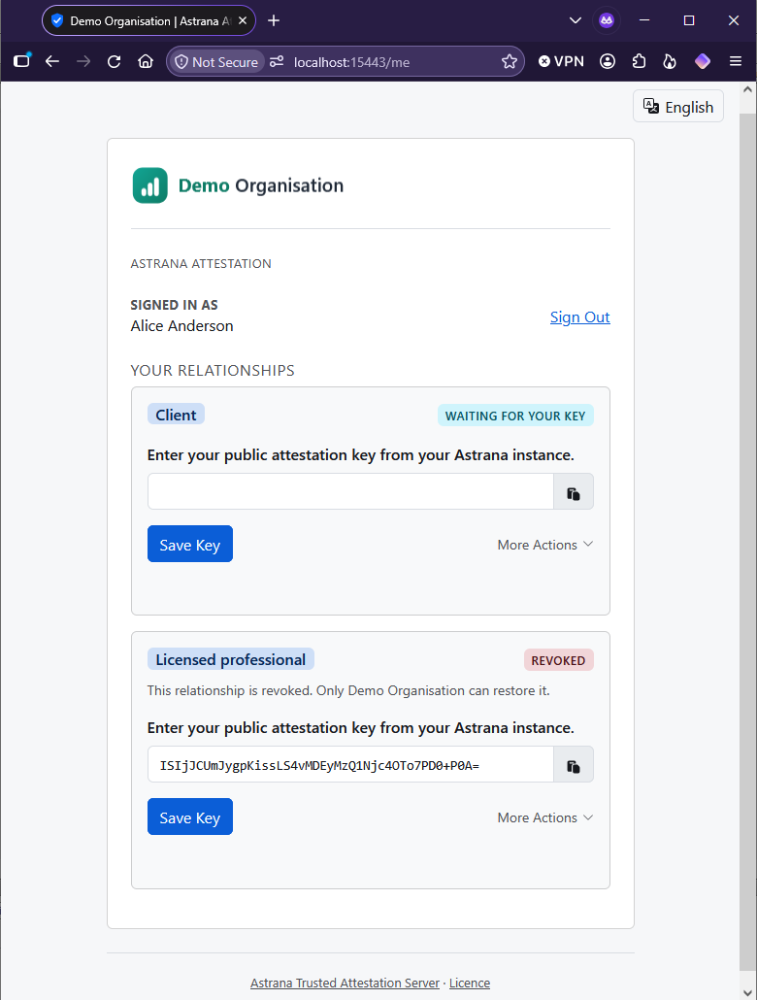
  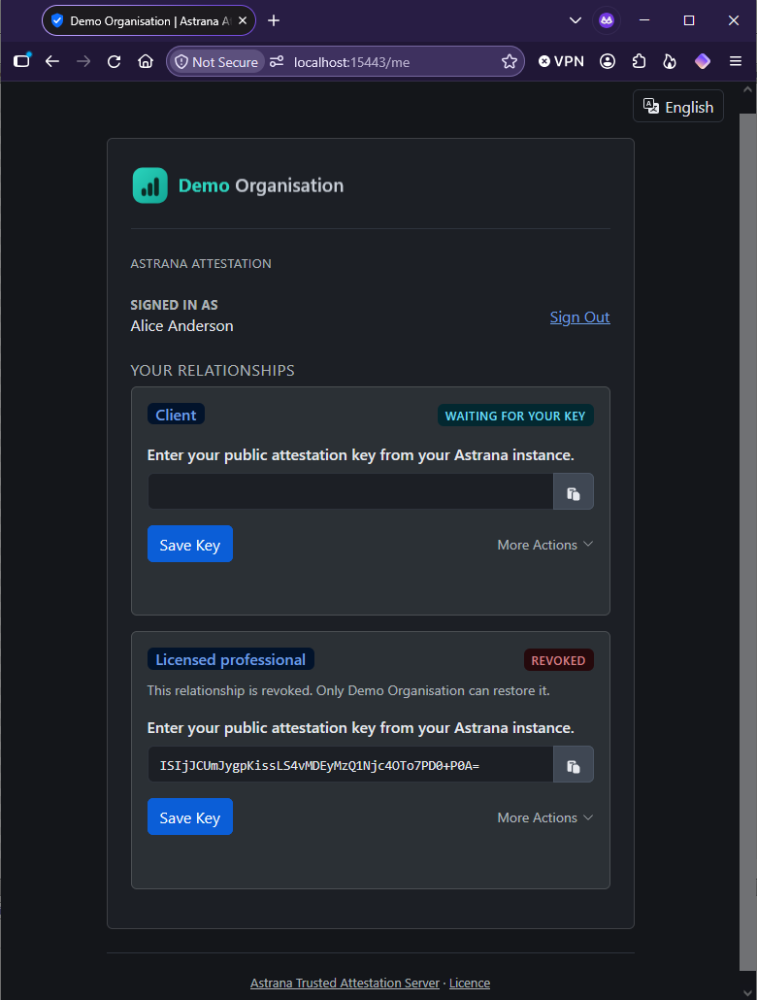
</p>

## Ask the organisation, as a verifying Astrana instance would

When an Astrana instance is shown a member's key, it asks the organisation whether that key is on record. If it is, the
answer also gives the relationship's type, any subtype and its status. Ask the same question yourself, with the sample
key the demonstration added for alice's client relationship:

```bash
curl -sk https://localhost:15443/api/v1/attest -H "Content-Type: application/json" \
  -d '{"public_key":"AQIDBAUGBwgJCgsMDQ4PEBESExQVFhcYGRobHB0eHyA="}'
```

In PowerShell 7.3 or later:

```powershell
curl.exe -sk https://localhost:15443/api/v1/attest -H "Content-Type: application/json" -d '{"public_key":"AQIDBAUGBwgJCgsMDQ4PEBESExQVFhcYGRobHB0eHyA="}'
```

Windows PowerShell 5.1 removes the quotation marks inside the request, so run the Bash command in Git Bash instead.

The answer is `{"valid":true,"relationship_type":"client","status":"active"}`. The question carried no credentials and
no identity, and the answer names one relationship and nothing else. Ask about the key behind alice's revoked
relationship, `ISIjJCUmJygpKissLS4vMDEyMzQ1Njc4OTo7PD0+P0A=`, and the status is `revoked`. Ask about a key the
organisation does not hold, or about something that is not a key at all, and the answer is `{"valid":false}`.

## Register a key yourself

Alice's employee relationship is waiting for a key. A member's Astrana instance generates the attestation keypair and
shows the member the public key to paste. For the demonstration, make one yourself. The server accepts an Ed25519 public
key as 32 bytes in base64.

```bash
openssl genpkey -algorithm ed25519 | openssl pkey -pubout -outform DER | tail -c 32 | base64
```

In PowerShell:

```powershell
openssl genpkey -algorithm ed25519 -out "$env:TEMP\demo-key.pem"
openssl pkey -in "$env:TEMP\demo-key.pem" -pubout -outform DER -out "$env:TEMP\demo-key.der"
[Convert]::ToBase64String([IO.File]::ReadAllBytes("$env:TEMP\demo-key.der")[-32..-1])
```

Git for Windows does not put `openssl` on PowerShell's path. If PowerShell cannot find it, run the Bash command above in
Git Bash, or call `& 'C:\Program Files\Git\usr\bin\openssl.exe'` in place of `openssl`.

Paste the key into the Employee card's field and select Save Key. The relationship shows as active. Ask the organisation
about your key with the `curl` command above, with your key in place of the demonstration's, and the answer is now
`{"valid":true,"relationship_type":"employee","status":"active"}`.

<p>
  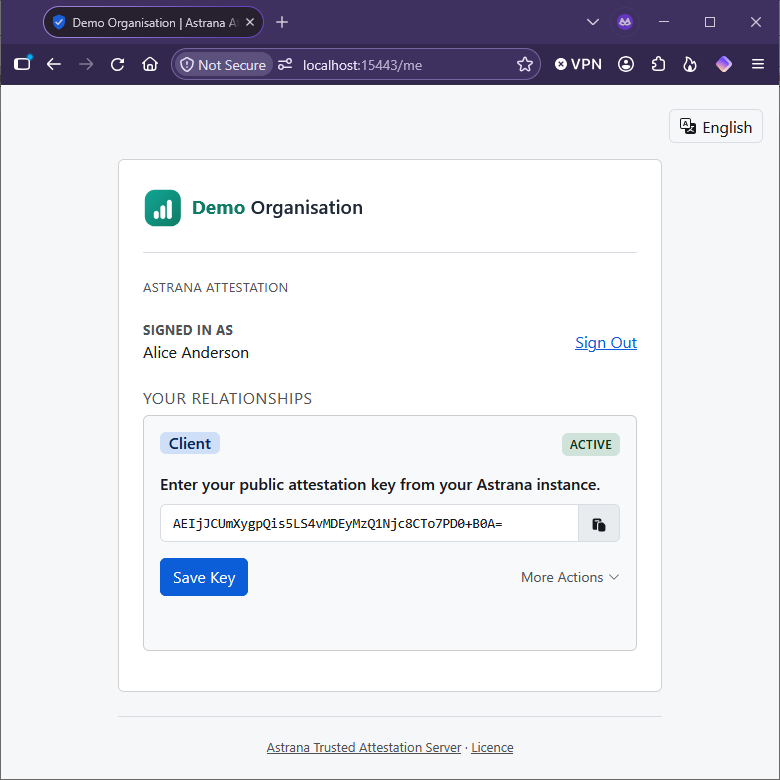
  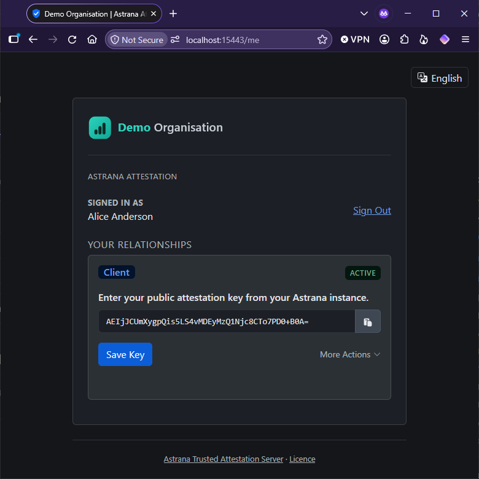
</p>

## Grant a relationship

The organisation grants relationships from its own systems. A member never can. In the demonstration, the organisation's
system is the database itself. The demonstration organisation attests to three types, `employee`, `client` and
`licensed_professional`. Its members and their identifiers:

| Member  | Identifier                             |
| ------- | -------------------------------------- |
| `alice` | `11111111-1111-4111-8111-111111111111` |
| `bob`   | `22222222-2222-4222-8222-222222222222` |
| `carol` | `33333333-3333-4333-8333-333333333333` |
| `dave`  | `44444444-4444-4444-8444-444444444444` |

Grant `dave` an employee relationship from a second terminal, in the repository root:

```bash
MSYS_NO_PATHCONV=1 docker compose -f dotnet/demo/docker-compose.yml exec db /opt/mssql-tools18/bin/sqlcmd \
  -S localhost -U sa -P "Trusted-Attestation-Demo-Password1" -d trusted_attestation -C \
  -Q "EXEC grant_member_relationship '44444444-4444-4444-8444-444444444444', 'employee', NULL, 'demo'"
```

`MSYS_NO_PATHCONV=1` stops Git Bash on Windows from rewriting the path to `sqlcmd`, and does nothing elsewhere. In
PowerShell, leave it out and write the command on one line, without the backslashes. The same goes for the Java and PHP
commands below.

For Java:

```bash
docker compose -f java/demo/docker-compose.yml exec db psql -U trusted_attestation -d trusted_attestation \
  -c "CALL grant_member_relationship('44444444-4444-4444-8444-444444444444', 'employee', NULL, 'demo')"
```

For PHP:

```bash
docker compose -f php/demo/docker-compose.yml exec db mysql -u trusted_attestation -ptrusted-attestation-demo-password \
  trusted_attestation -e "CALL grant_member_relationship('44444444-4444-4444-8444-444444444444', 'employee', NULL, 'demo')"
```

The four arguments are the member's identifier at the identity provider, the relationship type, an optional subtype, and
who is granting, which goes into the audit log. Sign in as `dave` and the relationship is there, waiting for a key.

<p>
  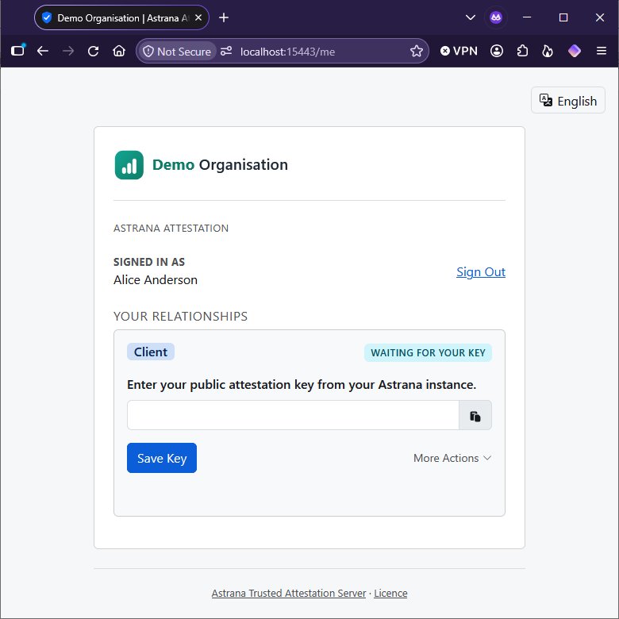
  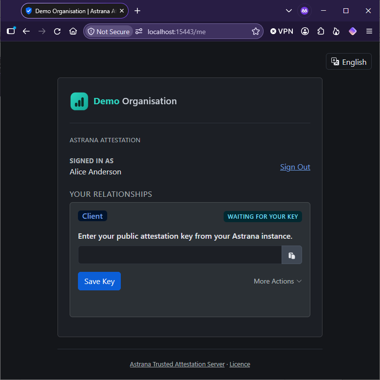
</p>

Then sign back in as `alice` and try the rest of the page on the employee relationship you added a key to earlier. Empty
the key field and select Save Key, which clears it. Ask about the key again, and the answer is `{"valid":false}`,
because the key is no longer on record. Save the key again, revoke the relationship under More Actions and ask again,
and the status is `revoked`.

<p>
  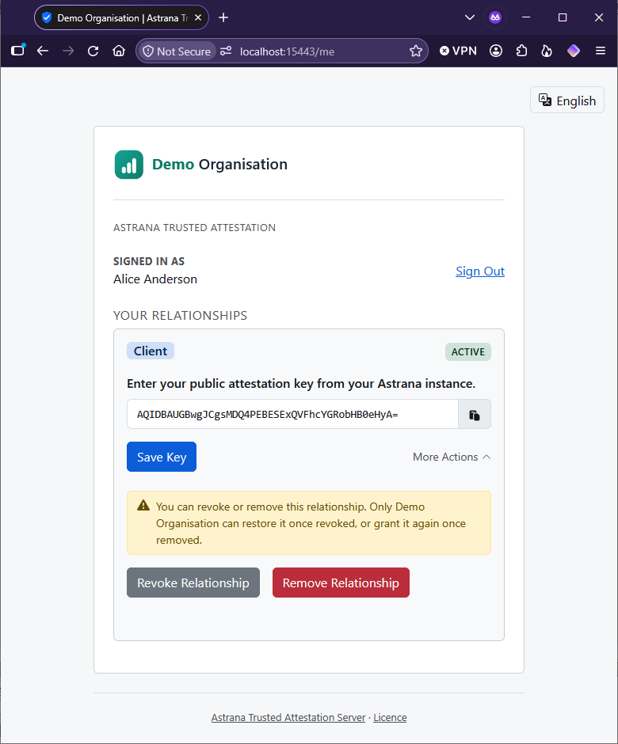
  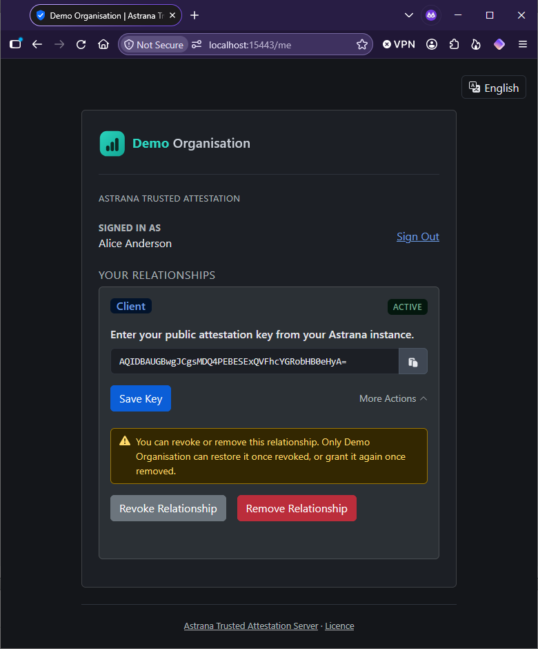
</p>

Only the organisation can restore it. In the demonstration, run this with the same connection you used for the grant:

```sql
EXEC extend_member_relationship '11111111-1111-4111-8111-111111111111', 'employee', NULL, 'demo'
```

On PostgreSQL and MySQL the call is
`CALL extend_member_relationship('11111111-1111-4111-8111-111111111111', 'employee', NULL, 'demo')`. The third argument
is the new expiry date, and `NULL` means the relationship never expires.

## The manifest

Open https://localhost:15443/.well-known/ata-manifest.json. A verifying Astrana instance reads this file first. It holds
the organisation's name and logo, the relationship types the organisation attests to, and the addresses of its landing
page and its attestation endpoint.

## Sign out

Sign Out, next to your name on the self-service page, ends your session and brings you back to the landing page, which
confirms that you have signed out.

<p>
  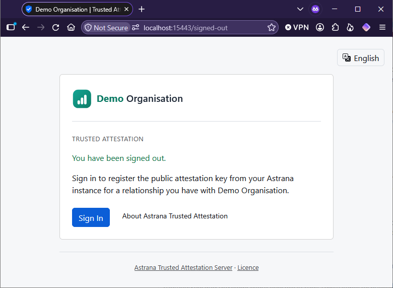
  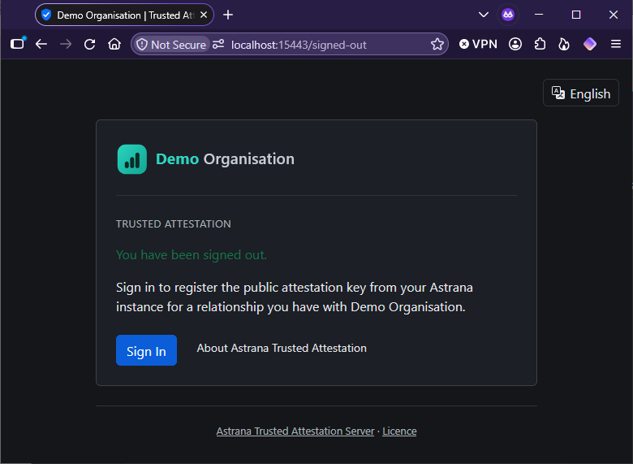
</p>

## Stop

```bash
docker compose -f dotnet/demo/docker-compose.yml down -v
```

Use the compose file you started with. The `-v` removes the demonstration's volumes, so the next start is clean.

## The demonstration is not a deployment

A real deployment signs members in through the organisation's own identity and access management system, keeps its
records in a database the organisation runs, and terminates TLS with a real certificate. The
[installation guide](installation.md) covers that.
